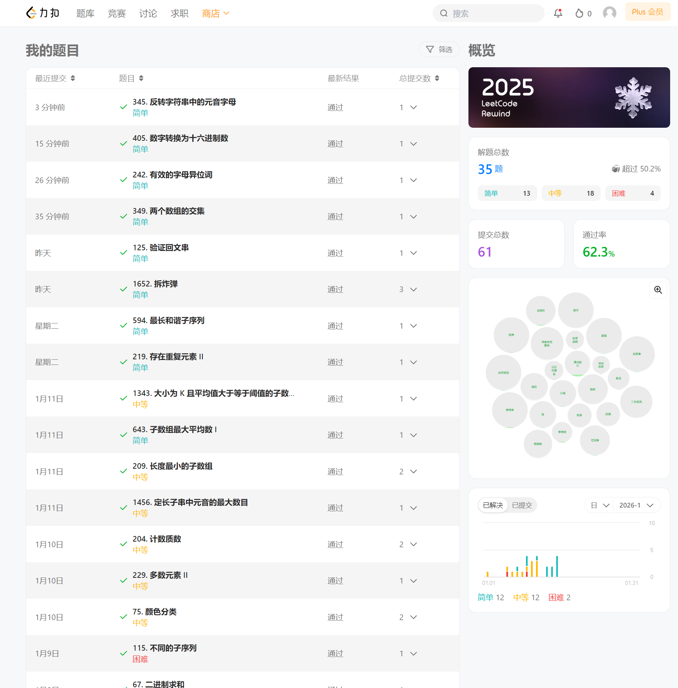

## 基础
最基础的知识: 如何计算复杂度(时间复杂度，空间复杂度），这个关系到写代码的时候，如何在取选择最优的算法或者判断你选择的算法是否满足题目的要求。<br>
举几个直观例子<br>

1.   <b> 对于单次循环而言</b>

```
for (int i = 0; i < n; i++) 
```
这个时间复杂度为O(n), 如果其中n为100,0000，那么cpu执行的时间差不多就是1s

2. <b>对于多次循环而言</b>

```
for (int i = 0; i < n; i++) {
    for (int j = i; j < n; j++) {
        
    }
}

```
这个时间复杂度为O(n^2), 如果为100,000那么整个时间就会变成100,000 * 100,000，远远超过1s，这个时间肯定是不满足题目要求的，如果n < 2000，那么就可以采用O(n ^ 2)的算法

3. <b> 对于递归而言</b>

   简单来说，时间复杂度为o(2^n), 所以这种题目一般要求n都比较小

有时候可以通过时间复杂度来判断应该选择什么算法，比如[分割回文串](https://leetcode.cn/problems/palindrome-partitioning/description/?envType=problem-list-v2&envId=string),其中n为16，这个时候可以大概判断是使用dfs来进行递归遍历，后续再补


## 练手题

[最长和谐子序列](https://leetcode.cn/problems/longest-harmonious-subsequence/) —— [提交记录](./code/练手题/longest-harmonious-subsequence.py) [提交记录2](./code/练手题/longest-harmonious-subsequence_v2.py)

[存在重复元素 II](https://leetcode.cn/problems/contains-duplicate-ii/) —— [提交记录](./code/练手题/contains-duplicate-ii.py)

[拆炸弹](https://leetcode.cn/problems/defuse-the-bomb/) —— [提交记录](./code/练手题/defuse-the-bomb.py) [提交记录2](./code/练手题/defuse-the-bomb_v2.py)

[验证回文串](https://leetcode.cn/problems/valid-palindrome/) —— [提交记录](./code/valid-palindrome.py)

[有效的字母异位词](https://leetcode.cn/problems/valid-anagram/) —— [提交记录](./code/valid-anagram.py)

[反转字符串中的元音字母](https://leetcode.cn/problems/reverse-vowels-of-a-string/) —— [提交记录](./code/reverse-vowels-of-a-string.py)

[数字转换为十六进制数](https://leetcode.cn/problems/convert-a-number-to-hexadecimal/) —— [提交记录](./code/convert-a-number-to-hexadecimal.py)

[两个数组的交集](https://leetcode.cn/problems/intersection-of-two-arrays/) —— [提交记录](./code/intersection-of-two-arrays.py)

***

2026.01.17更新


## 滑动窗口

###### 一、题型1：定长滑动窗口

必看：[前置知识](./notes/滑动窗口.md)

***

【基础版】

[定长子串中元音的最大数目](https://leetcode.cn/problems/maximum-number-of-vowels-in-a-substring-of-given-length/) 

[子数组最大平均数 I](https://leetcode.cn/problems/maximum-average-subarray-i/)

[大小为 K 且平均值大于等于阈值的子数组数目](https://leetcode.cn/problems/number-of-sub-arrays-of-size-k-and-average-greater-than-or-equal-to-threshold/)

[半径为 k 的子数组平均值](https://leetcode.cn/problems/k-radius-subarray-averages/)

[得到 K 个黑块的最少涂色次数](https://leetcode.cn/problems/minimum-recolors-to-get-k-consecutive-black-blocks/)

[几乎唯一子数组的最大和](https://leetcode.cn/problems/maximum-sum-of-almost-unique-subarray/)

[长度为 K 子数组中的最大和](https://leetcode.cn/problems/maximum-sum-of-distinct-subarrays-with-length-k/) 

[可获得的最大点数](https://leetcode.cn/problems/maximum-points-you-can-obtain-from-cards/) 

***

【进阶版 - 不急着做】

[使库存平衡的最少丢弃次数](https://leetcode.cn/problems/minimum-discards-to-balance-inventory/)

[爱生气的书店老板](https://leetcode.cn/problems/grumpy-bookstore-owner/)

[重新安排会议得到最多空余时间 I](https://leetcode.cn/problems/reschedule-meetings-for-maximum-free-time-i/) 

###### 二、题型2：不定长滑动窗口

不定长滑动窗口主要分为三类：求最长子数组，求最短子数组，求子数组个数。

***

【基础版】

[无重复字符的最长子串](https://leetcode.cn/problems/longest-substring-without-repeating-characters/)

[每个字符最多出现两次的最长子字符串](https://leetcode.cn/problems/maximum-length-substring-with-two-occurrences/) 

[删掉一个元素以后全为 1 的最长子数组](https://leetcode.cn/problems/longest-subarray-of-1s-after-deleting-one-element/) 

[使数组平衡的最少移除数目](https://leetcode.cn/problems/minimum-removals-to-balance-array/) 

[尽可能使字符串相等](https://leetcode.cn/problems/get-equal-substrings-within-budget/) 

[水果成篮](https://leetcode.cn/problems/fruit-into-baskets/) 

[删除子数组的最大得分](https://leetcode.cn/problems/maximum-erasure-value/) 

[最多 K 个重复元素的最长子数组](https://leetcode.cn/problems/length-of-longest-subarray-with-at-most-k-frequency/) 

[考试的最大困扰度](https://leetcode.cn/problems/maximize-the-confusion-of-an-exam/) 

[最大连续 1 的个数 III](https://leetcode.cn/problems/max-consecutive-ones-iii/) 

[将 x 减到 0 的最小操作数](https://leetcode.cn/problems/minimum-operations-to-reduce-x-to-zero/) 

[最长半重复子数组](https://leetcode.cn/problems/longest-semi-repeating-subarray/)

***

【进阶版 —— 不急着做】

###### 三、题型3：分组循环

###### 四、题型4：单序列双指针


## 递归

必看： [前置知识](./notes/递归.md)

***

###### 一、题型1: 回溯

[子集](https://leetcode.cn/problems/subsets/) —— [提交记录]()

[电话号码的字母组合](https://leetcode.cn/problems/letter-combinations-of-a-phone-number/)

[全排列](https://leetcode.cn/problems/permutations/)

[组合总和](https://leetcode.cn/problems/combination-sum/)

[单词搜索](https://leetcode.cn/problems/word-search/)

[分割回文串](https://leetcode.cn/problems/palindrome-partitioning/)

[岛屿数量](https://leetcode.cn/problems/number-of-islands/)

[括号生成](https://leetcode.cn/problems/generate-parentheses/)

[全排列 II](https://leetcode.cn/problems/permutations-ii/)

[组合总和 II](https://leetcode.cn/problems/combination-sum-ii/)

***


###### 二、题型2: 二叉树

必看： [前置知识](./notes/递归.md)

***

【基础篇】

[二叉树的最大深度](https://leetcode.cn/problems/maximum-depth-of-binary-tree/)  —— [提交记录](./code/maximum-depth-of-binary-tree.py)  后序遍历

[翻转二叉树](https://leetcode.cn/problems/invert-binary-tree/) —— [提交记录](./code/invert-binary-tree.py) 后序遍历

[对称二叉树](https://leetcode.cn/problems/symmetric-tree/)

[路径总和](https://leetcode.cn/problems/path-sum/)

[二叉树的直径](https://leetcode.cn/problems/diameter-of-binary-tree/)

[二叉树展开为链表](https://leetcode.cn/problems/flatten-binary-tree-to-linked-list/)

[从前序与中序遍历序列构造二叉树](https://leetcode.cn/problems/construct-binary-tree-from-preorder-and-inorder-traversal/)

[从中序与后序遍历序列构造二叉树](https://leetcode.cn/problems/construct-binary-tree-from-inorder-and-postorder-traversal/)

[二叉树剪枝](https://leetcode.cn/problems/binary-tree-pruning/)

***

【提升篇】

***


###### 三、题型3: 分治与递归

###### 四、题型4:  其他递归应用

###### 五、详细总结

[跳转地址](./notes/递归.md)


## 排序

###### 一、题型1：归并排序

[合并两个有序数组](https://leetcode.com/problems/merge-sorted-array/)

[ 合并两个有序链表](https://leetcode.com/problems/merge-two-sorted-lists/)

[ 合并K个升序链表](https://leetcode.com/problems/merge-k-sorted-lists/)

[ 排序链表](https://leetcode.com/problems/sort-list/)

[翻转对](https://leetcode.com/problems/reverse-pairs/)

[ 区间和的个数](https://leetcode.com/problems/count-of-range-sum/)


###### 二、题型2：自定义排序

[重新排列日志文件](https://leetcode.com/problems/reorder-data-in-log-files/)

[ 根据数字二进制下1的数目排序](https://leetcode.com/problems/sort-integers-by-the-number-of-1-bits/)

[ 自定义字符串排序](https://leetcode.com/problems/custom-sort-string/)

[ 根据身高重建队列](https://leetcode.com/problems/queue-reconstruction-by-height/)

[最大数](https://leetcode.com/problems/largest-number/)

[ 合并区间](https://leetcode.com/problems/merge-intervals/)

###### 三、题型3：快速排序

[多数元素](https://leetcode.com/problems/majority-element/)

[ 颜色分类](https://leetcode.com/problems/sort-colors/)

[数组中的第K个最大元素](https://leetcode.com/problems/kth-largest-element-in-an-array/)

[排序数组](https://leetcode.com/problems/sort-an-array/)

[ 最接近原点的K个点](https://leetcode.com/problems/k-closest-points-to-origin/)

[ 摆动排序 II](https://leetcode.com/problems/wiggle-sort-ii/)

###### 四、题型4：堆排序/优先队列

[最后一块石头的重量](https://leetcode.com/problems/last-stone-weight/)

[ 数据流中的第K大元素](https://leetcode.com/problems/kth-largest-element-in-a-stream/)

[ 前K个高频元素](https://leetcode.com/problems/top-k-frequent-elements/)

[有序矩阵中第K小的元素](https://leetcode.com/problems/kth-smallest-element-in-a-sorted-matrix/)

[ 数据流的中位数](https://leetcode.com/problems/find-median-from-data-stream/)

[ 滑动窗口最大值](https://leetcode.com/problems/sliding-window-maximum/)

###### 五、题型5：桶排序

[ 数组的相对排序](https://leetcode.com/problems/relative-sort-array/)

[有效的字母异位词](https://leetcode.com/problems/valid-anagram/)

[H指数](https://leetcode.com/problems/h-index/)

[根据字符出现频率排序](https://leetcode.com/problems/sort-characters-by-frequency/)

[最大间距](https://leetcode.com/problems/maximum-gap/)

[ 存在重复元素 III](https://leetcode.com/problems/contains-duplicate-iii/)

###### 六、题型6：拓扑排序

[课程表](https://leetcode.com/problems/course-schedule/)

[ 课程表 II](https://leetcode.com/problems/course-schedule-ii/)

[ 火星词典](https://leetcode.com/problems/alien-dictionary/)

[ 最小高度树](https://leetcode.com/problems/minimum-height-trees/)

[ 矩阵中的最长递增路径](https://leetcode.com/problems/longest-increasing-path-in-a-matrix/)

[序列重建](https://leetcode.com/problems/sequence-reconstruction/)

###### 七、详细解释


[跳转地址](./notes/排序.md)

## 字符串

[跳转地址](notes/字符串.md)


## 刷题记录


