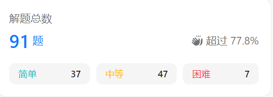

## 练手题

[最长和谐子序列](https://leetcode.cn/problems/longest-harmonious-subsequence/) —— [提交记录](./code/练手题/longest-harmonious-subsequence.py) [提交记录2](./code/练手题/longest-harmonious-subsequence_v2.py)

[存在重复元素 II](https://leetcode.cn/problems/contains-duplicate-ii/) —— [提交记录](./code/练手题/contains-duplicate-ii.py)

[拆炸弹](https://leetcode.cn/problems/defuse-the-bomb/) —— [提交记录](./code/练手题/defuse-the-bomb.py) [提交记录2](./code/练手题/defuse-the-bomb_v2.py)

[验证回文串](https://leetcode.cn/problems/valid-palindrome/) —— [提交记录](./code/练手题/valid-palindrome.py)

[有效的字母异位词](https://leetcode.cn/problems/valid-anagram/) —— [提交记录](./code/练手题/valid-anagram.py)

[反转字符串中的元音字母](https://leetcode.cn/problems/reverse-vowels-of-a-string/) —— [提交记录](./code/练手题/reverse-vowels-of-a-string.py)

[数字转换为十六进制数](https://leetcode.cn/problems/convert-a-number-to-hexadecimal/) —— [提交记录](./code/练手题/convert-a-number-to-hexadecimal.py)

[两个数组的交集](https://leetcode.cn/problems/intersection-of-two-arrays/) —— [提交记录](./code/练手题/intersection-of-two-arrays.py)

***

## 热题

[最大子数组和](https://leetcode.cn/problems/maximum-subarray/)  —— [提交记录](./top100热题/maximum-subarray.py)

[最小栈](https://leetcode.cn/problems/min-stack/description/?envType=study-plan-v2&envId=top-100-liked) —— [提交记录](./top100热题/min-stack.py)

[盛最多水的容器](https://leetcode.cn/problems/container-with-most-water/) —— [提交记录](./top100热题/container-with-most-water.py)

[无重复字符的最长子串](https://leetcode.cn/problems/longest-substring-without-repeating-characters/) —— [提交记录](./top100热题/longest-substring-without-repeating-characters.py)

[合并区间](https://leetcode.cn/problems/merge-intervals/) —— [提交记录](./top100热题/merge-intervals.py)

[轮转数组](https://leetcode.cn/problems/rotate-array/) —— [提交记录](./top100热题/rotate-array.py)

[除了自身以外数组的乘积](https://leetcode.cn/problems/product-of-array-except-self/) —— [提交记录](./top100热题/product-of-array-except-self.py)

[缺失的第一个正数](https://leetcode.cn/problems/first-missing-positive/) —— [提交记录](./top100热题/first-missing-positive.py)

[找到字符串中所有字母异位词](https://leetcode.cn/problems/find-all-anagrams-in-a-string/) —— [提交记录](./top100热题/find-all-anagrams-in-a-string.py)

## 链表

[删除排序链表中的重复元素](https://leetcode.cn/problems/remove-duplicates-from-sorted-list/)  —— [提交记录](./code/链表/remove-duplicates-from-sorted-list.py)

[移除链表元素](https://leetcode.cn/problems/remove-linked-list-elements/) —— [提交记录](./code/链表/remove-linked-list-elements.py)

[环形链表](https://leetcode.cn/problems/linked-list-cycle/) —— [提交记录](./code/链表/linked-list-cycle.py)

[ 环形链表 II](https://leetcode.cn/problems/linked-list-cycle-ii/)

[相交链表](https://leetcode.cn/problems/intersection-of-two-linked-lists/)

## 滑动窗口

[定长子串中元音的最大数目](https://leetcode.cn/problems/maximum-number-of-vowels-in-a-substring-of-given-length/) 

[子数组最大平均数 I](https://leetcode.cn/problems/maximum-average-subarray-i/)

[无重复字符的最长子串](https://leetcode.cn/problems/longest-substring-without-repeating-characters/)

[每个字符最多出现两次的最长子字符串](https://leetcode.cn/problems/maximum-length-substring-with-two-occurrences/) 

[删掉一个元素以后全为 1 的最长子数组](https://leetcode.cn/problems/longest-subarray-of-1s-after-deleting-one-element/) 

## 排序

[合并两个有序数组](https://leetcode.cn/problems/merge-sorted-array/) —— 归并排序

[重新排列日志文件](https://leetcode.com/problems/reorder-data-in-log-files/) —— 自定义排序

[最后一块石头的重量](https://leetcode.cn/problems/last-stone-weight/) —— 堆排序

[ 数组的相对排序](https://leetcode.cn/problems/relative-sort-array/) —— 桶排序

## 字符串

[344. 反转字符串](https://leetcode.cn/problems/reverse-string/)

[125. 验证回文串](https://leetcode.cn/problems/valid-palindrome/)

[ 14. 最长公共前缀](https://leetcode.cn/problems/longest-common-prefix/)

[ 8. 字符串转换整数 (atoi)](https://leetcode.cn/problems/string-to-integer-atoi/)

## 数据结构

## 碎碎念

总觉得大模型总结比我好很多，好像我总结的也没多大帮助。但是陪伴也是有意义的吧，所以以后应该都是一起打卡了。

再加上一个[大模型目录](./大模型知识汇总)，里面包括一些大模型相关知识点.

## 刷题记录

